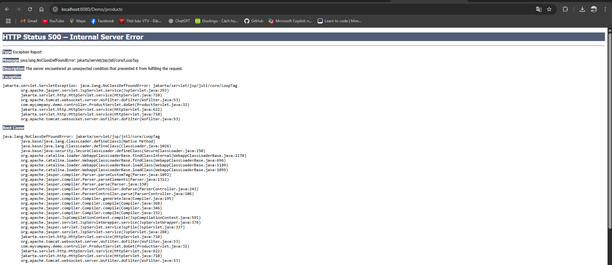

# JSP-EL-JSTL

Dự án minh họa sử dụng **Java Servlet/JSP**, **Expression Language (EL)** và **JSTL (Java Standard Tag Library)** trong môn học **Lập trình Java nâng cao**.

## 🚀 Giới thiệu

- **JSP (Java Server Pages)**: Công nghệ kết hợp HTML và Java để tạo trang web động.
- **EL (Expression Language)**: Cung cấp cú pháp `${}` đơn giản để truy xuất dữ liệu từ Servlet trong JSP.
- **JSTL (Java Standard Tag Library)**: Bộ thẻ chuẩn hỗ trợ lặp, điều kiện, định dạng số và ngày tháng.

Project minh họa cách:
- Tạo Servlet trả dữ liệu sản phẩm.
- Hiển thị danh sách sản phẩm bằng JSP với EL và JSTL.
- Sử dụng Maven quản lý dependency và Tomcat để triển khai.

---

## 📂 Cấu trúc thư mục

JSP-EL-JSTL-Demo/<br>
│── pom.xml<br>
│── src<br>
│ └── main<br>
│ ├── java<br>
│ │ └── com.example.demo<br>
│ │ ├── model<br>
│ │ │ └── Product.java<br>
│ │ └── controller<br>
│ │ └── ProductServlet.java<br>
│ ├── resources<br>
│ └── webapp<br>
│ ├── WEB-INF<br>
│ │ └── web.xml<br>
│ ├── index.jsp<br>
│ └── views<br>
│ └── products.jsp<br>

---

## ⚙️ Công nghệ sử dụng

- Java 8/11+
- Servlet API 4.0.1
- JSP + JSTL 1.2
- Maven
- Apache Tomcat 9/10

---

## 🛠 Cài đặt và chạy project

### 1. Clone hoặc tải project

```bash
git clone https://github.com/your-username/JSP-EL-JSTL-Demo.git
cd JSP-EL-JSTL-Demo
```

### 2. Mở project trong NetBeans / IntelliJ / Eclipse
Chọn Open Project → Chỉ tới thư mục project Maven.

### 3. Cấu hình Server
- Cài đặt Apache Tomcat (phiên bản 9 hoặc 10).
- Thêm server vào IDE (NetBeans: Tools → Servers → Add Server).

### 4. Cấu hình Maven
Đảm bảo pom.xml chứa dependencies JSTL:

```xml
<dependency>
    <groupId>javax.servlet</groupId>
    <artifactId>jstl</artifactId>
    <version>1.2</version>
</dependency>
```

### 5. Chạy project
- Chuột phải → Run hoặc deploy lên Tomcat.
- Truy cập: `http://localhost:8080/JSP-EL-JSTL-Demo/`

---

## 🧩 Chức năng minh họa
- Trang chủ (index.jsp): Link đến trang sản phẩm.
- ProductServlet: Tạo danh sách sản phẩm và forward đến JSP.
- products.jsp:
    - Sử dụng EL để truy xuất thuộc tính (`${p.name}`, `${p.price}`).
    - Sử dụng JSTL:
        - <c:forEach>: Lặp danh sách sản phẩm.
        - <fmt:formatNumber>: Định dạng giá thành tiền tệ.

---

## 📸 Ảnh minh họa giao diện

### 1. Trang chủ (index.jsp)


> Trang chủ đơn giản với tiêu đề và liên kết sang danh sách sản phẩm.

---

### 2. Trang danh sách sản phẩm (products.jsp)


> Hiển thị danh sách sản phẩm bằng bảng, sử dụng **EL** để truy xuất giá trị và **JSTL** để lặp dữ liệu (`<c:forEach>`) và định dạng tiền tệ (`<fmt:formatNumber>`).
(Do lỗi code nên không chạy được).

---

## 📚 Kiến thức rút ra
- Cách tích hợp EL và JSTL trong JSP.
- Cách dùng Maven để quản lý dependencies Servlet/JSTL.
- Forward dữ liệu từ Servlet sang JSP qua request.setAttribute.

---

## 📝 License
Dự án được phân phối theo giấy phép MIT.

---

## ✍️ Tác giả
- Tên sinh viên: Hoàng Nghĩa Minh Bảo
- Môn học: Lập trình Java nâng cao
- Giảng viên: ThS. Đoàn Minh Khuê

---
